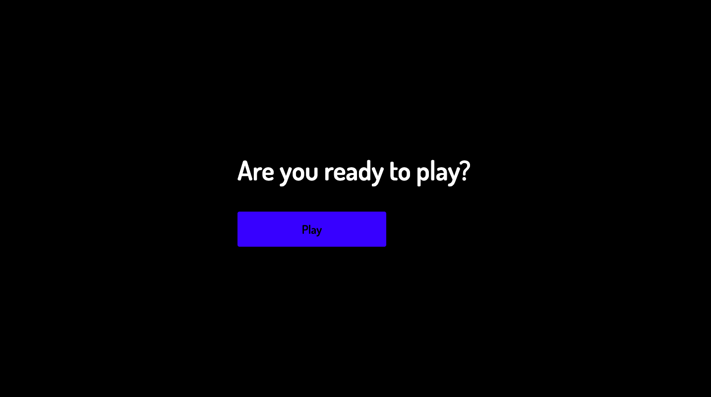
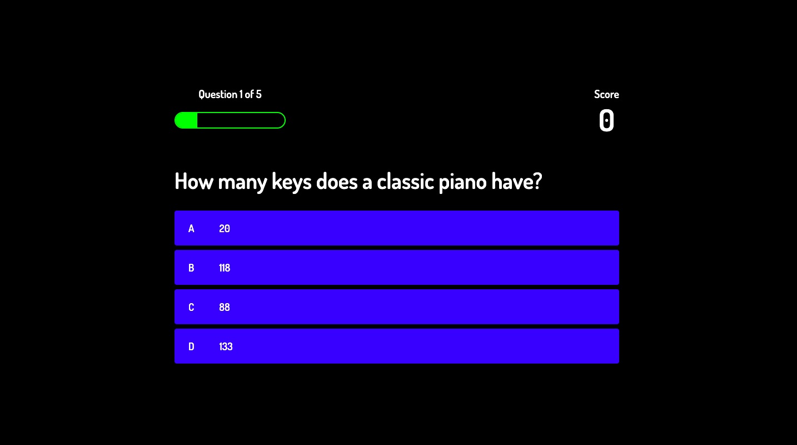
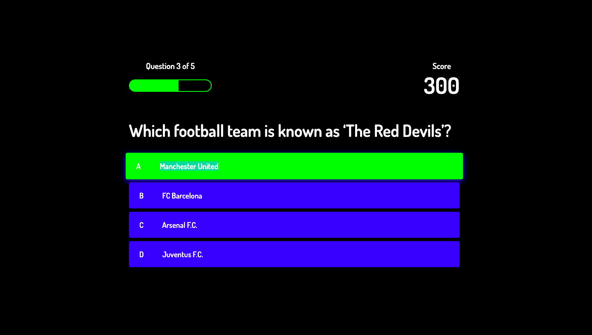
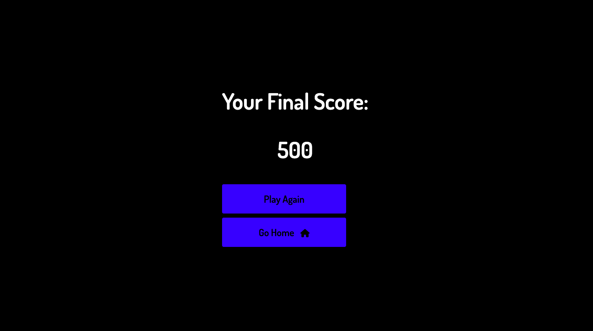

# Quiz-System

## Introduction

In this project, a simple online quiz system which is being implemented using HTML, CSS and JavaScript. This is a simple web based quiz application used to take quiz online .

## Features

### Home Page

### Quiz Page

### Final Score Page

## Tech Stack
+ HTML
+ CSS
+ JavaScript

## Developers
<table>
<td>

Mahima Khatri

</td>
</tr>
</table>
